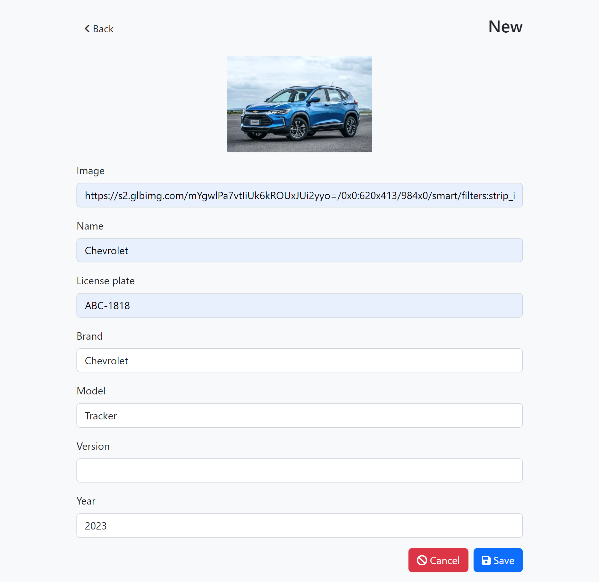
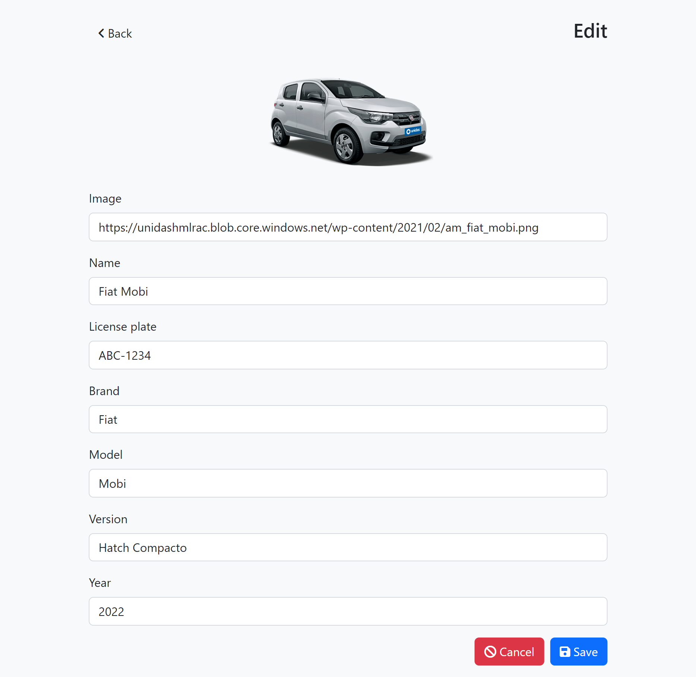

# Desafio técnico Dev Full Stack

Este teste visa avaliar os conhecimentos e habilidades na nossa stack de tecnologias necessários para aplicação a oportunidade de desenvolvedor full stack aqui na [Sofit](https://sofit4.com.br).

# Instruções
- Clone o repositório
- Acesse o diretório do projeto
- Inicie o docker e execute `docker-compose up`

# Backend
- Acesso: `localhos:3000`
- Endpoints:
    - POST: `/vehicles`
    - GET: `/vehicles?page=1`
    - GET: `/vehicles/:id`
    - UPDATE: `/vehicles/:id`
    - DELETE: `/vehicles/:id`

# Frontend
- Acesso: `localhos:4200`

    Index

    Novo Registro

    Edição de Registro

